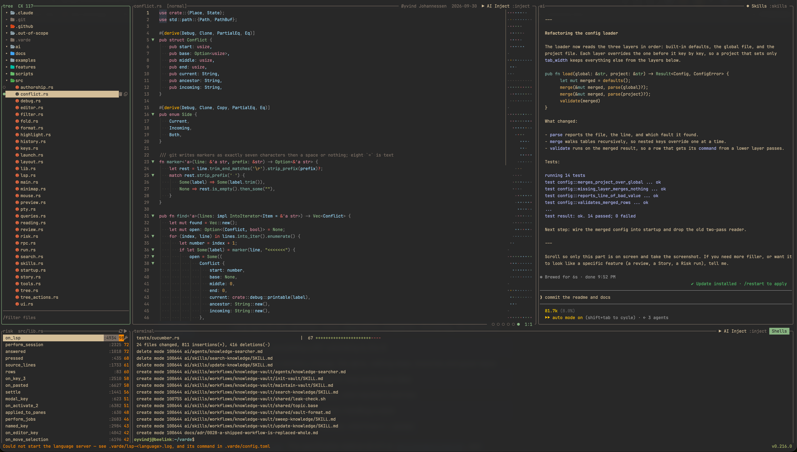

# Varde

*A varde is a stone cairn that marks the way for whoever comes next.*

Varde is a terminal IDE. Open it on a folder and you get a file tree, a modal editor, your shell and
an AI CLI side by side in one terminal. It also has a git review you can annotate and send back to
the AI. Varde is built with coding agents.



## Install

On macOS or Linux:

```sh
curl -fsSL https://raw.githubusercontent.com/oyvij/varde-editor/main/install.sh | bash
```

The script downloads the latest release binary to `~/.local/bin/varde` and checks it against the
release's `SHA256SUMS`. To build from a checkout instead, answer "source" at the first prompt. To
update, run the script again or run `:update` inside Varde. [`docs/install.md`](docs/install.md)
has the details.

To build from source by hand:

```sh
cargo build --release
ln -sfn "$(pwd)/target/release/varde" ~/.local/bin/varde
```

## Run

```sh
varde .            # open the current folder
varde ~/some/repo  # open another folder
varde              # open the current folder without writing .varde/ into it
```

Press `Ctrl+Space` to open the palette. It reaches every pane, view and command.

The first run in a project writes `.varde/config.toml` with every key commented out. Global settings
go in `~/.varde/config.toml`. See [Configuration](docs/guide/configuration.md).

## What it does

- **Edit view.** A file tree, a Vim-style modal editor, your shell and an AI CLI.
- **Review view.** Diffs of the files git reports as changed. Annotate line ranges as `ISSUE`,
  `NOTE`, `SUGGESTION` or `COMMENT`, then submit the review to disk and to the AI session.
- **Story view.** The AI writes a change up as named steps in the order the code runs, and you walk
  the steps in the editor.
- **Risk.** Per-function complexity as a count and a list. The refactor loop asks the AI to lower
  it, and Varde reverts the pass if the tests fail or the number did not go down.
- **Markdown preview.** Headings, tables, lists and Mermaid diagrams, drawn in the terminal.
- **Language servers and debuggers.** Hover, go-to-definition, completion, diagnostics,
  breakpoints and stack frames.
- **Reading aloud.** `:read` speaks the selection.
- **Knowledge base.** A Vault of Markdown Notes shared by every workspace, which also opens in
  Obsidian. The Knowledge view browses it, and Skills you pick from the AI pane have the AI session
  write Notes into it. See [Knowledge base](docs/guide/knowledge.md).
- **Any AI CLI.** Varde passes keys, mouse and terminal queries through unchanged, and has no code
  for any specific CLI.

## Documentation

The user guide is in [`docs/guide/`](docs/guide/README.md):

| Guide | Covers |
|---|---|
| [Getting around](docs/guide/getting-around.md) | Panes, views, the palette, the file tree, the terminal, the mouse |
| [Editing](docs/guide/editing.md) | Modes, motions, search, multi-cursor, folding, every `:` command |
| [Language intelligence](docs/guide/language-intelligence.md) | Language servers, diagnostics, completion, formatting |
| [Debugging](docs/guide/debugging.md) | Breakpoints, launch configurations, frames |
| [Review](docs/guide/review.md) | Annotating a diff and submitting it to the AI |
| [Stories](docs/guide/stories.md) | Walking a change step by step |
| [Risk](docs/guide/risk.md) | The Risk list and the refactor loop |
| [AI pane](docs/guide/ai-pane.md) | Hosting an AI CLI and what reaches it |
| [Knowledge base](docs/guide/knowledge.md) | The Vault, Skills and the Knowledge view |
| [Reading aloud](docs/guide/reading-aloud.md) | `:read`, speed and installing a voice |
| [Configuration](docs/guide/configuration.md) | Every config key |

## Development

```sh
cargo test                    # unit tests and Gherkin scenarios
cargo test --test cucumber    # scenarios only
cargo clippy -- -D warnings
```

Read [`AGENTS.md`](AGENTS.md) before changing anything. `src/` is pure: one `update()` takes the
state and an event and returns the new state and a list of effects. `src/main.rs`, `src/ui.rs` and
`src/pty.rs` run those effects against the terminal, the pty and the filesystem.

- [`docs/example-map.md`](docs/example-map.md) is the spec, and `features/*.feature` runs it.
- [`docs/stack.md`](docs/stack.md) lists every dependency and why it is there.
- [`docs/adr/`](docs/adr/) holds the decisions, and [`GLOSSARY.md`](GLOSSARY.md) the terms.

## About

I build Varde feature by feature with Matt Pocock's skills and workflow, for fun and to try ideas
for understanding and steering code that agents write. Use it if you like, and open a PR if you
want to contribute.
